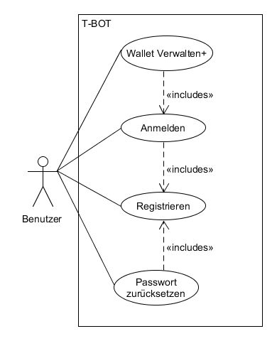
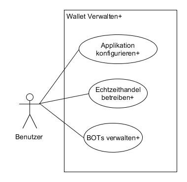
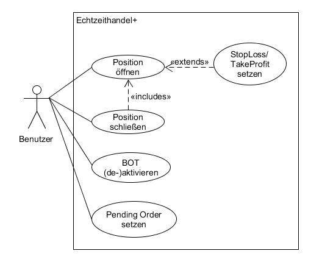
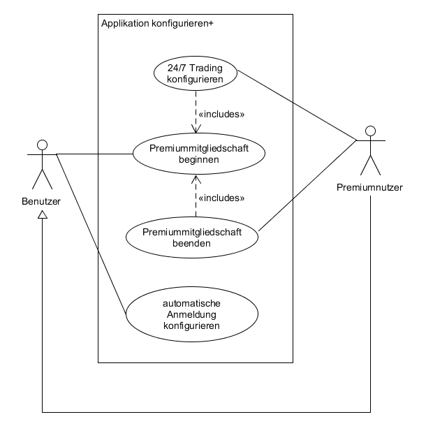
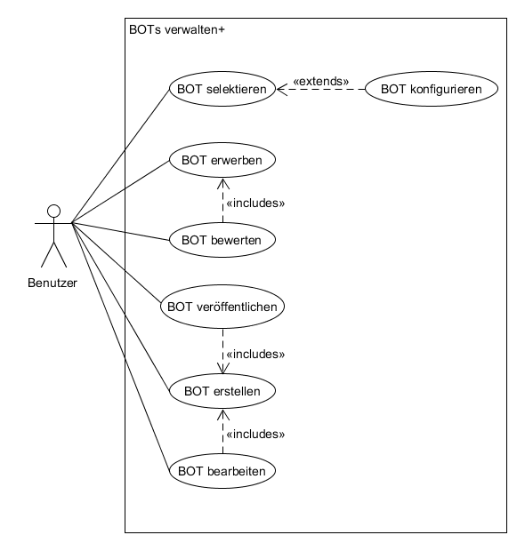
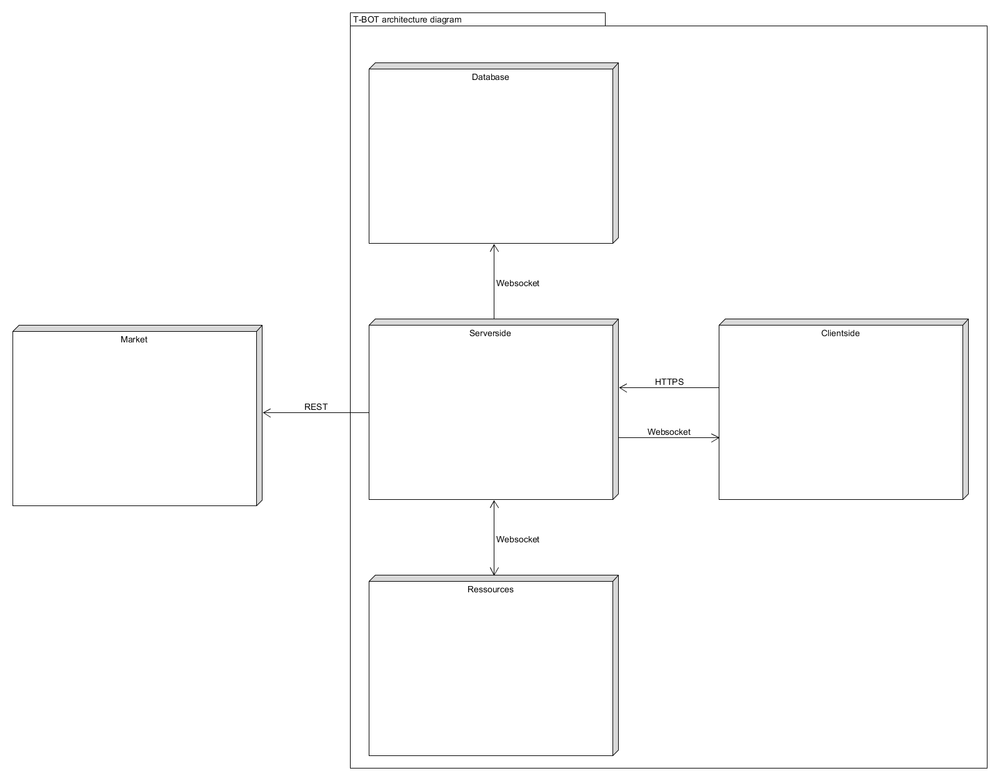
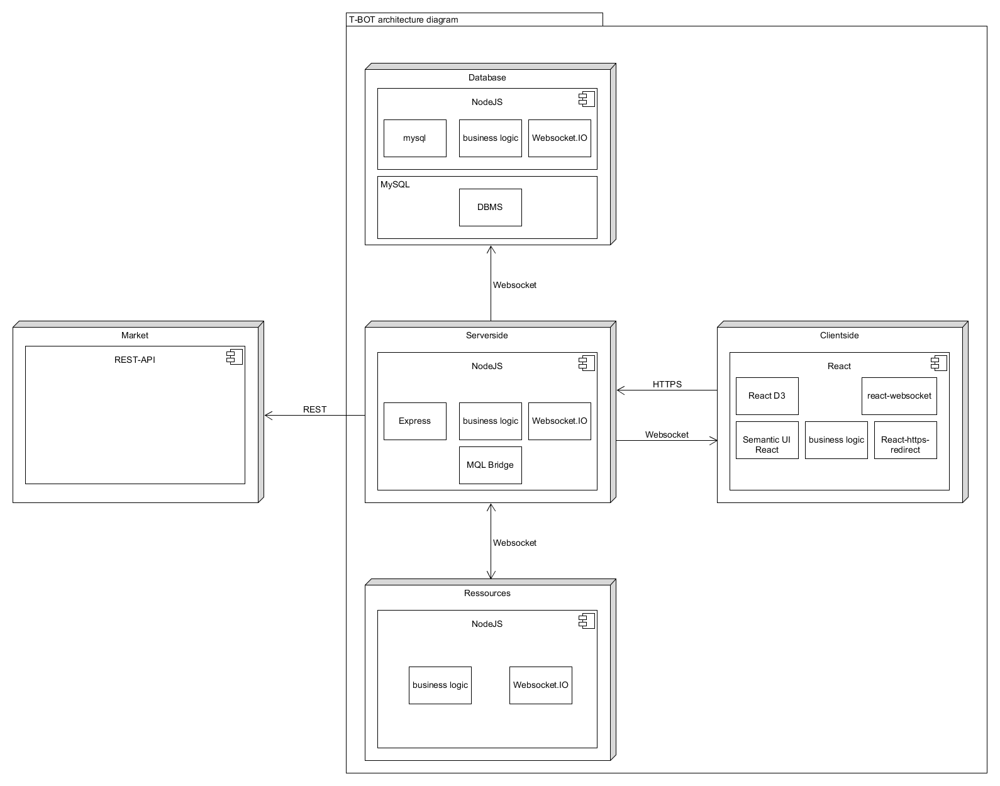

# Anforderungs- und Entwurfsspezifikation ("Pflichtenheft")

T-BOT, Nikolai Kloß

# 1 Einführung

## 1.1 Beschreibung
    Bei "T-BOT" handelt es sich um einen automatisierten Händler für
    Kryptowährungen. Die progressive-Web-App ist in der Lage, Depot's/Wallets
    diverser Handelsplattformen zu verwalten und Positionen an den jeweiligen
    Märkten zu öffnen/schließen. Dem Benutzer steht es hierbei offen,
    in Echtzeit selbst zu handeln, oder dieses, einen der frei- oder
    auch käuflich erwerbaren Handelsalgorithmen zu überlassen.

    Die Handelsalgorithmen (BOTs) lassen sich vom Anwender selbst erstellen.
    Die BOTs können für den eigenen Gebrauch eingeschränkt werden, oder aber
    auch publiziert zur freien Verfügung stehen, oder für Geld angeboten werden.

    Die Applikation liegt in 2 Varianten vor. T-BOT kann
    kostenlos verwendet werden. Die Bezahlversion beinhaltet
    das Feature, dass der eingesetzte BOT 24/7 handelt,
    unabhängig davon, ob der Anwender die App beendet hat.
    Es werden hierzu Serverressourcen bereitgestellt.

    Die Bezahlversion wird in Form eines monatlichen Abonnements realisiert.

    Die "PWA" Rich-Client-Applikation ist plattformunabhängig und auch im
    Webbrowser ausführbar.

## 1.2 Ziele
    - Anwendungsbereiche:
          Die Applikation findet im Bereich des automatisierten-echtzeit-Handels
          seinen Platz.

    - Motivation:
          Eine von Community, um Algorithmen beliebig erweiterbare
          und plattformunabhängige, freie Trading-Applikation schaffen.

    - Umfang:
          * Verwaltung von Wallets diverser Handelsplattformen
          * Visualisierung von Charts, Positionen, Indizes
          * Echtzeithandel in der Applikation
          * Automatisierter handel durch spezielle Algorithmen (BOTs)
          * BOTs lassen sich vom Anwender erstellen
          * BOTs lassen sich vom Ersteller käuflich vertreiben   
          * BOTs lassen sich von Anwendern bewerten

    - Alleinstellungsmerkmale:
          * Automatisierter Handel ist erweiterbar
          * Die Applikation ist für den Anwender wahlweise kostenlos   

    - Zielbenutzergruppen:
          * Gute Kenntnisse in IT-technischen Zusammenhängen
          * Interesse am Kryptowährungenhandel
          * Kenntnisse zu finanzwirtschaftlichen Kontext
          * Erfahrungen in Spekulationsgeschäften

    - Abgrenzung:
          * keine Garantie für Profit
          * Ausschließlich für Kryptowährungenhandel (kein Forex, Aktien ...)          

# 2 Anforderungen

## 2.1 Funktionale Anforderungen
    - Use-Case Diagramme

**Allgemein:**

**Trading:**

**Konfiguration:**

## 2.2 Nicht-funktionale Anforderungen

### 2.2.1 Rahmenbedingungen

    Mindestens ein Handelskonto bei einen der unterstützten Handelsplattformen
    führen.

### 2.2.2 Betriebsbedingungen
    -   Betriebsbedingungen ist ein internetfähiges Endgerät, welches in der
        Lage ist die folgenden HTTPS/Webbrowser auszuführen.

        Unterstützte Webbrowser:
        ab Internet Explorer 9.0.8112.16421  
        ab Mozilla Firefox 10.0
        ab Opera 11.10
        ab Google Chrome 10.0

        Eine schnelle Internetverbindung wird empfohlen.

### 2.2.3 Qualitätsmerkmale
    - Performance
      Der Kern des Systems muss eine hohe Performanz vorweisen.
      Dies bedeutet, dass eine geringe Input/Output-Latenz Priorität besitzt.
      Ziel ist es, dass auf Ereignisse, möglichst Zeitnah eine Aktion folgt.

    - Sicherheit
      Die Kommunikation zwischen den Prozessen ist verschlüsselt.
      Der Client greift ausschließlich auf den Website-NodeJS-Server zu.
      Alle anderen Systemelemente liegen extra gekapselt hinter dem Website-NodeJS-Server und können auch nur von diesem kontaktiert werden.      
      Ressourcen-Server: muss "Ressourcen-Verschwender" erkennen und deren
      Ausführung unterbinden (bösartige Implementierungen die den Server zum Absturz bringen können z.B. while(true) Schleifen)

    - Zuverlässigkeit
      Ressourcen-Server: muss bei Ausfall automatisch neustarten
      MySQL-Server: alle 12h wird ein Datenbank-BackUp angelegt

    - Benutzerfreundlichkeit
      Die Views basieren auf dem "Adaptiv-Design" Layout um auf diversen Clients
      möglichst benutzerfreundlich dargestellt zu werden.

## 2.3 Graphische Benutzerschnittstelle
    - GUI-Mockups passend zu User Stories

    - Modellierung der Navigation zwischen den Screens der GUI-Mockups als Zustandsdiagramm

## 2.4 Anforderungen im Detail
    - User Stories mit Akzeptanzkritierien
    - Optional: Name (oder ID) und Priorität ("Must", "Should", "Could", "Won't")
    - Strukturierung der User Stories in funktionale Gruppen

**Allgemein:**

| **Als** | **möchte ich** | **so dass** | **Akzeptanz** | **Priorität** |
| :------ | :----- | :------ | :-------- |
| Benutzer| mich im System registrieren|ich mich anmelden kann|Anmeldung möglich|Must|
|Benutzer|mich im System anmelden|ich das System nutzen kann|Abmeldung möglich|Must|
|Benutzer|mich vom System abmelden|ich Sessions auf fremden Clients beenden kann|MessageBox: "Sie sind nun ausgeloggt"|Must|
|Benutzer|mein Passwort zurücksetzen|ich mich wieder im System anmelden kann|Anmeldung wieder möglich|Must|

**Konfiguration**

| **Als** | **möchte ich** | **so dass** | **Akzeptanz** | **Priorität** |
| :------ | :----- | :------ | :-------- |
|Benutzer|Premiummitglied werden|ich die Vorteile der Mitgliedschaft nutzen kann|MessageBox:"Sie sind nun Premiummitglied!"|Could|
|Premiumnutzer|die Premiummitgliedschaft beenden|ich die damit verbundenen Kosten nicht mehr tragen muss|MessageBox:"Sie sind nun kein Premiummitglied mehr!"|Could|
|Premiumnutzer|24/7 Trading konfigurieren|ich ggf. den BOT auch dann weiterhandeln lasse, selbst wenn die App clientseitig geschlossen wurde|Aktivierter BOT handelt trotz Beendigung der App am Client|Could|
|Premiumnutzer|automatische Anmeldung konfigurieren|ich mich nicht ständig an bestimmten Clients anmelden muss|Bei Aufruf der App wird die Anmeldung übersprungen|Should|

**Echtzeithandel**

| **Als** | **möchte ich** | **so dass** | **Akzeptanz** | **Priorität** |
| :------ | :----- | :------ | :-------- |
|Benutzer|Positionen öffnen können|ich aktiv am Handel teilnehmen kann|Position wird im Wallet gelistet|Must|
|Benutzer|Positionen schließen können|ich Gewinne/Verluste realisieren kann|Position wird aus der Wallet entfernt|Must|
|Benutzer|einen selektierten BOT aktivieren können| dieser die Handelsentscheidungen für mich trifft & agiert|MessageBox:"BOT Trading ist nun aktiviert!"|Must|
|Benutzer|einen selektierten BOT deaktivieren können|ich die Handelsentscheidungen selber treffe & agiere|MessageBox:"BOT Trading ist nun deaktiviert"|Must|
|Benutzer|StopLoss/TakeProfit setzen können|an den definierten Schwellwerten eine Position geschlossen wird| Position wird bei erreichen des Wertes aus dem Wallet entfernt|Must|
|Benutzer|eine Pending Order setzen| bei erreichen eines definierten Kurses, automatische eine Position eröffnet wird|Position erscheint bei Erfüllung der Bedingung im Wallet|Must|

**BOTs**

| **Als** | **möchte ich** | **so dass** | **Akzeptanz** | **Priorität** |
| :------ | :----- | :------ | :-------- |
|Benutzer|einen BOT selektieren|ich diesen auf meinen Chart anwenden kann|In der RealtimeChartView erscheint der selektierte BOT|Must|
|Benutzer|einen BOT konfigurieren|ich diesen nach meinen eigenen Parametern arbeiten lassen kann|MessageBox:"Ihre Parameter wurden übernommen!"|Must|
|Benutzer|einen BOT erwerben|ich diesen für meine Charts anwendbar machen kann|MessageBox:"Dieser BOT gehört nun Ihnen!"|Won't|
|Benutzer|einen BOT bewerten|andere Benutzer einen Endruck, noch vor Erwerb des Bots, kriegen können|Bewertung wird nun für alle angezeigt|Won't|
|Benutzer|einen selbst erstellten BOT veröffentlichen| dieser von anderen Benutzern verwendet werden kann| BOT wird zum Erwerb gelistet|Won't|
|Benutzer|einen BOT erstellen|der Handel nach eigener Strategie automatisiert werden kann|Der erstellte BOT steht nun zur Auswahl|Won't|
|Benutzer|einen erstellten BOT bearbeiten| ich diesen erweitern oder verändern kann|MessageBox:"Die Änderungen wurde gespeichert!"|Won't|
|Benutzer|Debugging-Funktionen nutzen|die Entwicklung/Fehlerbehebung eines BOTs erleichtert wird|Setzen von Breakpoints usw. möglich|Won't|

# 3 Technische Beschreibung

## 3.1 Systemübersicht
    - Systemarchitekturdiagramm ("Box-And-Arrow" Diagramm)

    - Schnittstellenbeschreibung

      [Clientside]:
        Websocket: Empfänger - für Benachrichtigungen von Serverside

          Route: für kritische (Fehler) Meldungen
          Route: für die Bestätigung einer Orderausführung
          Route: für Systeminformationen
          Route: für BOT-Nachrichten
          Route: für die Bewertung eines erstellten BOTs

        HTTPS: Sender - für Viewspezifische Kommunikation

          Route: für die verschiedenen Views
          Route: für die Premiummitgliedschaft
          Route: für die Konfiguration der App
          Route: für die Orders
          Route: für den Verkauf eines BOTs
          Route: für den Einkauf eines BOTs

      [Serverside]:

        Websocket: Sender - für Benachrichtungen zur Clientside

          Route: für kritische (Fehler) Meldungen
          Route: für die Bestätigung einer Orderausführung
          Route: für Systeminformationen
          Route: für BOT-Nachrichten
          Route: für die Bewertung eines erstellten BOTs

        Websocket: Bidirektional - für Kommunikation zu Ressources

          Route: für Start/Stop eines BOTs
          Route: für die Parametrisierung des BOTs
          Route: für Status des BOTs

        Websocket: Sender - für Kommunikation zu Database

          Route: für Versand von Anfragen

        REST: Sender - für Kommunikation zu Market

          Route: für Orderausführung am Market
          Route: für Authentifizierung am Market
          Route: für Status am Market (z.B. Positionen)

      [Ressources]:

        Websocket: Bidirektional - für Kommunikation zu Ressources

          Route: für Start/Stop eines BOTs
          Route: für die Parametrisierung des BOTs
          Route: für Statusnachrichten des BOTs

      [Database]:

        Websocket: Empfänger - für Kommunikation von Serverside

          Route: für Empfang von Anfragen

    - Kommunikationsprotokolle

      HTTPS: dient zur verschlüsselten Kommunikation, bei dem ausschließlich
      die Clientside den Nachrichtenaustausch zum Serverside startet.

      Websocket: ermöglicht die Benachrichtungen zwischen Clientside,
      Serverside und Ressources.

      REST: dient der Kommunikation zum Market um beispielsweise eine Order
      zu positionieren.

    - Datenformate
      JSON: zur Übertragung von Nachrichten.

## 3.2 Softwarearchitektur
    - Darstellung von Softwarebausteinen (Module, Schichten, Komponenten)

## 3.3 Datenmodell
    - Konzeptionelles Analyseklassendiagramm

## 3.4 Abläufe
    - Aktivitätsdiagramme für relevante Use Cases
    - Aktivitätsdiagramm für den Ablauf sämtlicher Use Cases

## 3.5 Entwurf
    - Detaillierte UML-Diagramme für relevante Softwarebausteine

# 4 Projektorganisation

## 4.1 Annahmen
    - Verwendete Technologien (Programmiersprache, Frameworks, etc.)

      Programmiersprachen:
        JavaScript, MySQL, HTML, CSS

        Pattern:
        REST

      Frameworks:
        React, NodeJS

      Testframeworks:
        Mocha, Chai, Sinon.js

## 4.2 Verantwortlichkeiten
    - Nikolai Kloß: zuständig für alle Rollen und Softwarebausteine.

## 4.3 Grober Projektplan
    - Meilensteine

| **Aufgabe** | **Start** | **Ende** |
| :------ | :----- | :------ |
|Einrichtung der VM-Entwicklungsumgebung|KW22|KW22|
|Einrichtung der DBMS|KW22|KW22|
|Primitive Schnitstellenkommunikation zwischen Architekturkomponenten implementieren|KW22|KW23|
|Tests implementieren|KW22|KW27|
|Erweiterte  Schnitstellenkommunikation zwischen Architekturkomponenten implementieren|KW23|KW25|
|Geschäftslogik - "Database" implementieren|KW23|KW24|
|Geschäftslogik - "Serverside" implementieren|KW24|KW25|
|Geschäftslogik - "Ressources" implementieren|KW24|KW25|
|Geschäftslogik - "Clientside" implementieren|KW26|KW27|

# 5 Anhänge

## 5.1 Glossar
    - Definitionen, Abkürzungen, Begriffe

## 5.2 Referenzen
    - Handbücher, Gesetze

## 5.3 Index
