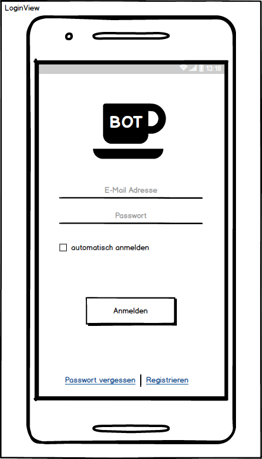
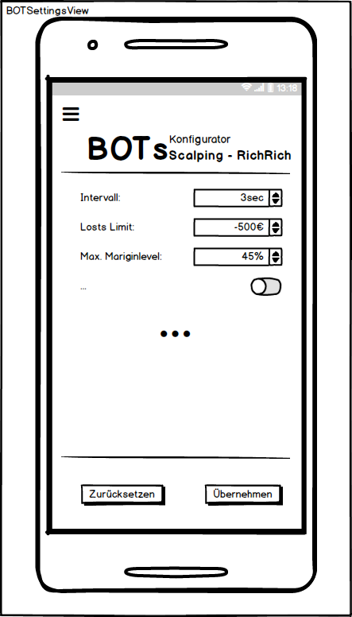

# Anforderungs- und Entwurfsspezifikation ("Pflichtenheft")

T-BOT, Nikolai Kloß, (Inhaltsverzeichnis)

# 1 Einführung

## 1.1 Beschreibung
    Bei "T-BOT" handelt es sich um einen automatisierten Händler für
    Kryptowährungen. Die progressive-Web-App ist in der Lage, Depot's/Wallets
    diverser Handelsplattformen zu verwalten und Positionen an den jeweiligen
    Märkten zu öffnen/schließen. Dem Benutzer steht es hierbei offen,
    in Echtzeit selbst zu handeln, oder dieses, einen der frei- oder
    auch käuflich erwerbaren Handelsalgorithmen zu überlassen.

    Die Handelsalgorithmen (BOTs) lassen sich vom Anwender selbst erstellen.
    Die BOTs können für den eigenen Gebrauch eingeschränkt werden, oder aber
    auch publiziert zur freien Verfügung stehen, oder für Geld angeboten werden.

    Die Applikation liegt in 2 Varianten vor. T-BOT kann
    kostenlos verwendet werden. Die Bezahlversion beinhaltet
    das Feature, dass der eingesetzte BOT 24/7 handelt,
    unabhängig davon, ob der Anwender die App beendet hat.
    Es werden hierzu Serverressourcen bereitgestellt.

    Die Bezahlversion wird in Form eines monatlichen Abonnements realisiert.

    Die "PWA" Rich-Client-Applikation ist plattformunabhängig und auch im
    Webbrowser ausführbar.

## 1.2 Ziele
    - Anwendungsbereiche:
          Die Applikation findet im Bereich des automatisierten-echtzeit-Handels
          seinen Platz.

    - Motivation:
          Eine von Community, um Algorithmen beliebig erweiterbare
          und plattformunabhängige, freie Trading-Applikation schaffen.

    - Umfang:
          * Verwaltung von Wallets diverser Handelsplattformen
          * Visualisierung von Charts, Positionen, Indizes
          * Echtzeithandel in der Applikation
          * Automatisierter handel durch spezielle Algorithmen (BOTs)
          * BOTs lassen sich vom Anwender erstellen
          * BOTs lassen sich vom Ersteller käuflich vertreiben   
          * BOTs lassen sich von Anwendern bewerten

    - Marktanforderungen:
          * Echtzeitanforderung, stabile Applikation, pflegende Community

    - Alleinstellungsmerkmale:
          * Automatisierter Handel ist erweiterbar
          * Die Applikation ist für den Anwender kostenlos   

    - Zielbenutzergruppen:
          * Gute Kenntnisse in IT-technischen Zusammenhängen
          * Interesse am Kryptowährungenhandel
          * Kenntnisse zu finanzwirtschaftlichen Kontext
          * Erfahrungen in Spekulationsgeschäften

    - Abgrenzung:
          * keine Garantie für Profit
          * Ausschließlich für Kryptowährungenhandel (kein Forex, Aktien ...)          

# 2 Anforderungen

## 2.1 Funktionale Anforderungen
    - Use-Case Diagramme

    - Strukturierung der Diagramme in funktionale Gruppen

## 2.2 Nicht-funktionale Anforderungen

### 2.2.1 Rahmenbedingungen
    - Normen, Standards, Protokolle, Hardware, externe Vorgaben

### 2.2.2 Betriebsbedingungen
    - Vorgaben des Kunden (z.B. Web Browser / Betriebssystem Versionen, Programmiersprache)

### 2.2.3 Qualitätsmerkmale
    - Externe Qualitätsanforderungen (z.B. Performance, Sicherheit, Zuverlässigkeit, Benutzerfreundlichkeit)

## 2.3 Graphische Benutzerschnittstelle
    - GUI-Mockups passend zu User Stories

    - Modellierung der Navigation zwischen den Screens der GUI-Mockups als Zustandsdiagramm

## 2.4 Anforderungen im Detail
    - User Stories mit Akzeptanzkritierien
    - Optional: Name (oder ID) und Priorität ("Must", "Should", "Could", "Won't")
    - Strukturierung der User Stories in funktionale Gruppen

**Allgemein:**

| **Als** | **möchte ich** | **so dass** | **Akzeptanz** |
| :------ | :----- | :------ | :-------- |
| Benutzer| mich im System registrieren|ich mich anmelden kann|Anmeldung möglich|
|Benutzer|mich im System anmelden|ich das System nutzen kann|Abmeldung möglich|
|Benutzer|mich vom System abmelden|ich Sessions auf fremden Clients beenden kann|MessageBox: "Sie sind nun ausgeloggt"|
|Benutzer|mein Passwort zurücksetzen|ich mich wieder im System anmelden kann|Anmeldung wieder möglich|

**Konfiguration**

| **Als** | **möchte ich** | **so dass** | **Akzeptanz** |
| :------ | :----- | :------ | :-------- |
|Benutzer|Premiummitglied werden|ich die Vorteile der Mitgliedschaft nutzen kann|MessageBox:"Sie sind nun Premiummitglied!"|
|Benutzer|die Premiummitgliedschaft beenden|ich die damit verbundenen Kosten nicht mehr tragen muss|MessageBox:"Sie sind nun kein Premiummitglied mehr!"
|Benutzer|24/7 Trading konfigurieren|ich ggf. den BOT auch dann weiterhandeln lasse, selbst wenn die App clientseitig geschlossen wurde|Aktivierter BOT handelt trotz Beendigung der App am Client|
|Benutzer|automatische Anmeldung konfigurieren|ich mich nicht ständig an bestimmten Clients anmelden muss|Bei Aufruf der App wird die Anmeldung übersprungen|

**Echtzeithandel**

| **Als** | **möchte ich** | **so dass** | **Akzeptanz** |
| :------ | :----- | :------ | :-------- |
|Benutzer|

**BOTs**

| **Als** | **möchte ich** | **so dass** | **Akzeptanz** |
| :------ | :----- | :------ | :-------- |
|Benutzer|

# 3 Technische Beschreibung

## 3.1 Systemübersicht
    - Systemarchitekturdiagramm ("Box-And-Arrow" Diagramm)
    - Schnittstellenbeschreibung
    - Kommunikationsprotokolle, Datenformate

## 3.2 Softwarearchitektur
    - Darstellung von Softwarebausteinen (Module, Schichten, Komponenten)

## 3.3 Datenmodell
    - Konzeptionelles Analyseklassendiagramm

## 3.4 Abläufe
    - Aktivitätsdiagramme für relevante Use Cases
    - Aktivitätsdiagramm für den Ablauf sämtlicher Use Cases

## 3.5 Entwurf
    - Detaillierte UML-Diagramme für relevante Softwarebausteine

# 4 Projektorganisation

## 4.1 Annahmen
    - Nicht durch den Kunden definierte spezifische Annahmen, Anforderungen und Abhängigkeiten
    - Verwendete Technologien (Programmiersprache, Frameworks, etc.)
    - Einschränkungen, Betriebsbedingungen und Faktoren, die die Entwicklung beeinflussen (Betriebssysteme, Entwicklungsumgebung)
    - Interne Qualitätsanforderungen (z.B. Softwarequalitätsmerkmale wie z.B. Erweiterbarkeit)

## 4.2 Verantwortlichkeiten
    - Zuordnung von Personen zu Softwarebausteinen aus Kapitel 3.1 und 3.2
    - Rollendefinition und Zuordnung

## 4.3 Grober Projektplan
    - Meilensteine

# 5 Anhänge

## 5.1 Glossar
    - Definitionen, Abkürzungen, Begriffe

## 5.2 Referenzen
    - Handbücher, Gesetze

## 5.3 Index
